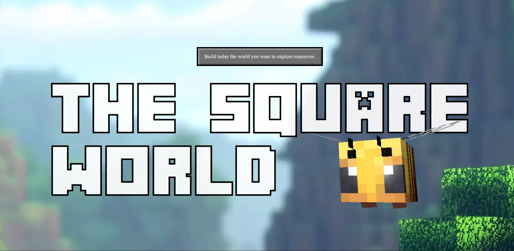

# Minecraft 3D Experience

A 3D interactive web experience inspired by the Minecraft universe.  
This project focuses on modern front-end techniques, real-time 3D rendering, and smooth animations to create an immersive environment directly in the browser.

## Technologies Used
- HTML5  
- CSS3  
- JavaScript  
- Three.js  
- GSAP 

## Project Goal
The goal of this project is to practice and improve front-end and 3D development skills by building an interactive experience using WebGL and animation libraries, focusing on performance and visual immersion.

## Features
- 3D environment rendered in real time  
- Smooth animations and transitions using GSAP  
- Interactive camera and scene elements  
- Immersive visual experience inspired by Minecraft  
- Optimized for desktop navigation  

## ⚠️ Responsiveness
This project is **designed only for desktop screens**.  
It is not fully responsive for mobile devices.

## Preview

## Live Preview
**[Click here to view the project](https://hickmannnn.github.io/Minecraft-3D-project/)**